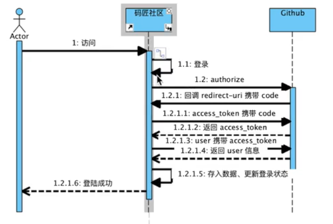

## 2019.10.10
### 工作事项：
1. 搭建了spring boot工作环境
1. 使用了bootstrap快速布置了前端的导航栏
1. 了解github的登录机制
### 学习的技术 
1. 使用spring boot 搭建一个简单的demo  
1.1 spring boot其中集成了优化好的tomcat，因此，直接运行就可以访问locahost:8080
，同样和spring mvc一样，spring要用controller去拦截请求  
  
    1.2 集成thymeleaf  

        '''
        xml中的配置
        
            <dependency>
                    <groupId>org.springframework.boot</groupId>
                    <artifactId>spring-boot-starter-thymeleaf</artifactId>
            </dependency>
        '''  

    controller中使用RequestMapper() 接收到请求以后，可以直接返回一个字符串
    框架会根据该字符串去template中寻找html文件（如果不使用thymeleaf就只能寻找jsp文件）
---
## 2019.10.11
### 工作事项
1. 完成从github上的登录
2. 将配置文件写入application.properties中

### 学习的技术
1. github登录流程  
    1.1  
    
    1.2 [学习文档](https://developer.github.com/apps/building-oauth-apps/authorizing-oauth-apps/)  
    
    1.3 流程解析  
    step1:点击项目中的登录页面,会跳转到github的授权页面(这个跳转地址是我们写在html中的,会携带一些参数-client_id等)  
    
    step2:点击授权,github会给redirect_uri返回一个一个code(这个code相当于一个口信,用于换token的,而token就像一个进场的门票)  
    
    step3:得到code,我们要继续向github post一个请求,其中又会携带一部分参数,其中一个重要的参数就是code  
    
    step4:github接收到code就会返回一个携带access_token的response,我们通过解析该response得到我们要的access_token  
    
    step5:紧接着用get请求携带access_token向GitHub请求,github会返回一组json文件,其中包含了用户的部分信息,我们可以从中拿到我们想要的用户信息
    
     
2. 如何将properties中的内容注入代码  
    2.1 使用value注解,用spring EL 表达式,将application.properties文件,详细可以看代码
---
## 2019.10.12
### 工作事项:
1. 了解cookie和session
1. 使用h2数据库,内存数据库,方便配置和使用,不用考虑服务器上的一堆问题
1. 继承mybatis,并对该数据库进行增删改查

### 学习的技术：
- 使用cookie和session  

    - 什么是 cookie 和session  
    老师在课上做了一个比喻：session比喻成银行中的账户，cookie比喻为银行发的银行卡，这两者有什么关系呢？我们手上可以有很多张银行卡，但是这些银行卡都对应了一个账户，我们只要验证了银行卡就能够去修改自己的账户信息  
    [cookie & session联系和区别](https://juejin.im/post/5aa783b76fb9a028d663d70a)  
    
    - 如何使用呢？  
    session是封装在request中,我们可以通过request.getSession.setAttribution()方法向session封装信息.  
    cookie是一种放在客户端中的码,在首次登录时,response会向客户端写入cookie,而下一次用户登录时都会携带cookie去访问服务器,服务器就可以从request中获取客户端发来的cookie,而这个cookie就作为我们验证的基础
    
      
- h2数据库  
    - 引入jar包  
    ```xml
            <dependency>
                <groupId>com.h2database</groupId>
                <artifactId>h2</artifactId>
                <version>1.4.199</version>
            </dependency>
    ```
    - 创建数据库  
    可以直接在idea中创建该数据库,具体的要求就是url和driver,创建好这个以后就有一个数据源了(datasource),而spring boot在properties中只要指定了相关参数就会自动的寻找数据库()
- mybatis持久层  

    - 依赖导入:这里用的不是完全的mybatis包,而是使用了与spring boot配合的包
    ```xml
      <dependency>
                <groupId>org.mybatis.spring.boot</groupId>
                <artifactId>mybatis-spring-boot-starter</artifactId>
                <version>2.1.0</version>
      </dependency>
    ```  
    - 使用mapper对接口注解并直接使用相关操作的语句完成对数据库的操作
---
## 2019.10.13
### 工作事项

- 将h2数据库更换成mysql
- 手动在cookie中加入我们一开始定义的token,然后带着token去数据库寻找用户

### 学习的技术

- 更换数据库的过程就是改动配置文件中那几个驱动，spring boot会自动将其注入到dataSource中，而mybatis将集成在spring boot中，只要写接口就能实现sql语句
- 为了让用户每次访问网站，在一定期限内登录都不过期，我们就需要在第一次登录的时候向客户端写入cookie，于时我们将在数据库中的token作为验证是哪一个用户的钥匙。用户下一次发送的请求就会携带cookie，并携带token这把钥匙，在下一次登录时只需要看里面的cookie中的token对应的是哪一个用户，就可以将这个用户信息拿到并封装到user中以供使用

---
## 2019.10.14

### 工作事项

- flyway：database migration，由于每次改动都会很麻烦，故这个项目我们就不用，记住这个数据库的理念就行，这是为了团队协作开发来使用的
- 使用bootstrap写发布界面

### 学习的技术
今天浪费了一整天，实在是太不快乐了，就此结束，就写了一个普通的页面

---
## 2019.10.15

### 工作事项：

- 将发布的内容写入数据库中
- 优化了代码逻辑
- 使用lombok自动为模型生成setter和getter方法(由于实现的东西不足以让我改代码，我并没有使用)
- 将文章展示到前台

### 学习的技术

---
## 2019.10.16

### 工作事项

- 使用thymeleaf中的foreach，和date.format方法完成页面内容上的完善
- 使用dto封装两个模型中的字段,这样做可以方便页面的展示
- 实现分页功能

### 学习的技术

- thymeleaf文档中有说明其中的foreach的写法，如果要想理解其原理，应该好好去看底层的书籍，现在跟着文档学会使用就好了  

- 这次项目中遇到的就是这个问题，由于model只能有一个，而现在article列表要一一遍历，而分页列表也要一一遍历，这时就得将这两个全部放到一个dto中去展示，可以看到我们的项目代码  

- 这次重点时分页，分页顾名思义就是将数据分页数展示，我们的做法就是每次查询一部分文章列表存入集合中，并且要有一个底部点选栏目可以控制页面。  
    - 算法细节：我们看前端控件，首先就是展示页码，页码很好确定，就是每次从数据库中去固定数目的文章，分多少次取就可以得到页面的数量，然后就是分析前后和返回第一页和最后一页的四个控件，控件的显示可以在dto中封装几个字段来决定是否显示，具体可以看代码  
--- 
## 2019.10.17

### 工作事项
